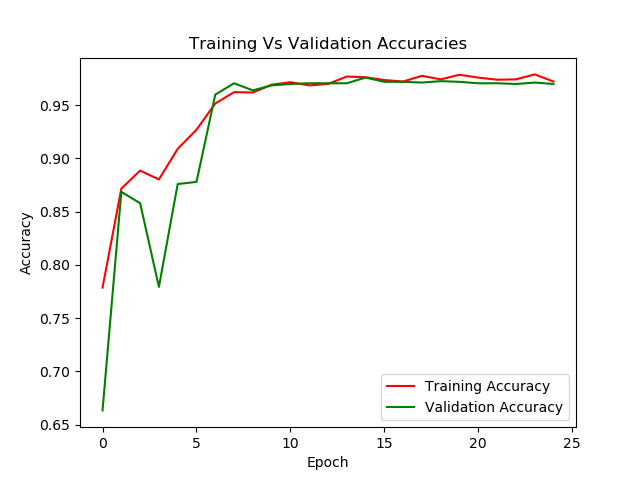
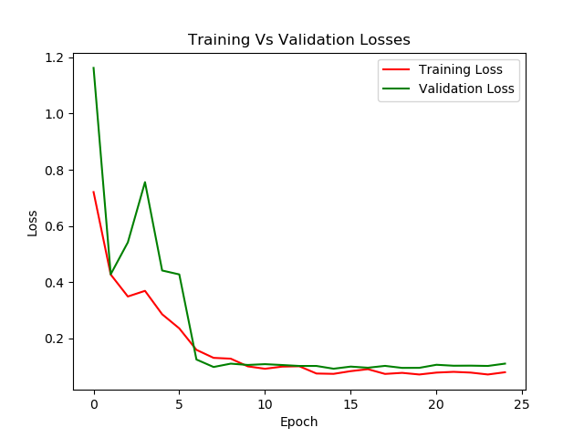
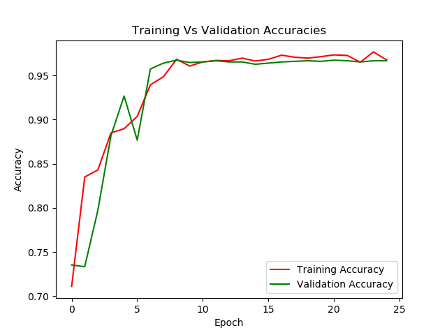
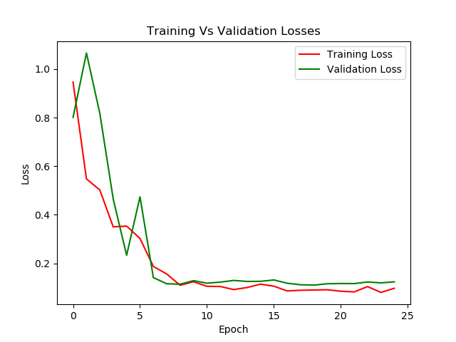

# fruit_classifier
A simple multi-class classifier for 15 types of fruit.
### Transfer Learning
Resnet18 and Resnet50 pretrained on Imagenet then finetuned using fruit images.
### Results
#### Resnet18
Accuracy of the network on the test images: 96 %  
Accuracy of Apple : 83 %  
Accuracy of Banana : 100 %  
Accuracy of Carambola : 97 %  
Accuracy of Guava : 97 %  
Accuracy of  Kiwi : 88 %  
Accuracy of Mango : 98 %  
Accuracy of Orange : 100 %  
Accuracy of Peach : 100 %  
Accuracy of  Pear : 98 %  
Accuracy of Persimmon : 96 %  
Accuracy of Pitaya : 100 %  
Accuracy of  Plum : 100 %  
Accuracy of Pomegranate : 91 %  
Accuracy of Tomatoes : 99 %  
Accuracy of muskmelon : 99 %  
##### Confusion Matrix
[[166   0   0   0   0   0   0   5   0   0   0   0   3  16  10]  
 [  0 200   0   0   0   0   0   0   0   0   0   0   0   0   0]  
 [  0   0 194   0   0   6   0   0   0   0   0   0   0   0   0]  
 [  0   0   0 194   4   0   0   0   1   0   0   0   0   0   1]  
 [  0   0   1   0 177   0   0   0   0   0   0   0   0   0  22]  
 [  0   0   0   0   0 196   0   0   0   0   0   0   4   0   0]  
 [  0   0   0   0   0   0 200   0   0   0   0   0   0   0   0]  
 [  0   0   0   0   0   0   0 200   0   0   0   0   0   0   0]  
 [  0   0   0   0   0   0   0   0 197   0   0   0   0   0   3]  
 [  0   0   0   0   4   0   1   0   0 192   0   0   3   0   0]  
 [  0   0   0   0   0   0   0   0   0   0 200   0   0   0   0]  
 [  0   0   0   0   0   0   0   0   0   0   0 200   0   0   0]  
 [  0   0   2   0   7   1   0   4   0   0   0   0 183   0   3]  
 [  0   0   0   0   0   0   1   0   0   0   0   0   0 199   0]  
 [  0   0   0   0   0   0   0   0   1   0   0   0   1   0 198]]  
 ###### Loss and Accuracy
 
 

#### Resnet50
Accuracy of the network on the test images: 95 %  
Accuracy of Apple : 78 %  
Accuracy of Banana : 100 %  
Accuracy of Carambola : 99 %  
Accuracy of Guava : 98 %  
Accuracy of  Kiwi : 86 %  
Accuracy of Mango : 97 %  
Accuracy of Orange : 100 %  
Accuracy of Peach : 97 %  
Accuracy of  Pear : 99 %  
Accuracy of Persimmon : 98 %  
Accuracy of Pitaya : 100 %  
Accuracy of  Plum : 100 %  
Accuracy of Pomegranate : 90 %  
Accuracy of Tomatoes : 97 %  
Accuracy of muskmelon : 98 %  
##### Confusion Matrix
[[156   0   0   1   0   0   0   3   2   0   3   1   3  10  21]  
 [  0 200   0   0   0   0   0   0   0   0   0   0   0   0   0]  
 [  0   0 198   2   0   0   0   0   0   0   0   0   0   0   0]  
 [  0   0   0 197   2   0   0   0   1   0   0   0   0   0   0]  
 [  0   0   0   0 173   0   0   0   0   0   0   0   0   0  27]  
 [  0   0   0   3   0 194   0   0   0   0   0   0   3   0   0]  
 [  0   0   0   0   0   0 200   0   0   0   0   0   0   0   0]  
 [  5   0   0   0   0   0   0 195   0   0   0   0   0   0   0]  
 [  0   0   0   0   2   0   0   0 198   0   0   0   0   0   0]  
 [  0   0   0   0   2   0   1   0   0 197   0   0   0   0   0]  
 [  0   0   0   0   0   0   0   0   0   0 200   0   0   0   0]  
 [  0   0   0   0   0   0   0   0   0   0   0 200   0   0   0]  
 [  2   0   0   2  10   1   1   0   0   3   0   0 181   0   0]  
 [  6   0   0   0   0   0   0   0   0   0   0   0   0 194   0]  
 [  0   0   0   0   1   0   0   0   3   0   0   0   0   0 196]]  
 ###### Loss and Accuracy

 
