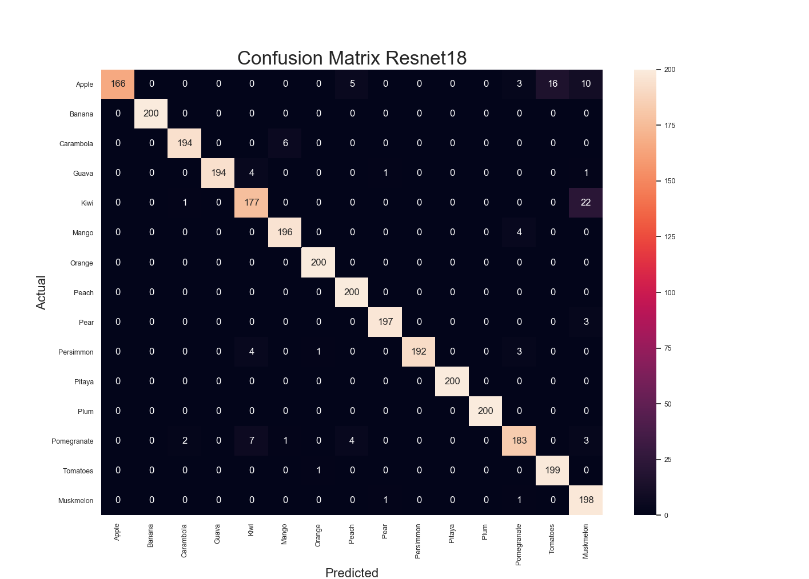
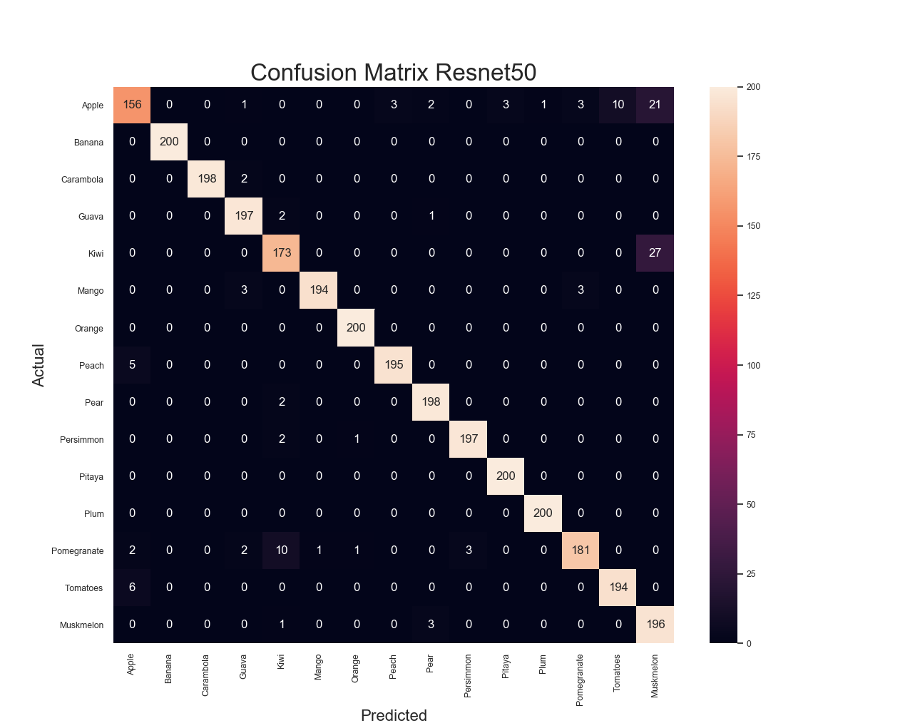

# fruit_classifier
A simple multi-class classifier for 15 types of fruit.
## Transfer Learning
Resnet18 and Resnet50 pretrained on Imagenet then finetuned using fruit images.
## Results
### Resnet18
Accuracy of the network on the test images: 96 %  
Accuracy of Apple : 83 %  
Accuracy of Banana : 100 %  
Accuracy of Carambola : 97 %  
Accuracy of Guava : 97 %  
Accuracy of  Kiwi : 88 %  
Accuracy of Mango : 98 %  
Accuracy of Muskmelon : 99 %  
Accuracy of Orange : 100 %  
Accuracy of Peach : 100 %  
Accuracy of  Pear : 98 %  
Accuracy of Persimmon : 96 %  
Accuracy of Pitaya : 100 %  
Accuracy of  Plum : 100 %  
Accuracy of Pomegranate : 91 %  
Accuracy of Tomatoes : 99 %  
#### Confusion Matrix
  
 #### Loss and Accuracy
 
 

### Resnet50
Accuracy of the network on the test images: 95 %  
Accuracy of Apple : 78 %  
Accuracy of Banana : 100 %  
Accuracy of Carambola : 99 %  
Accuracy of Guava : 98 %  
Accuracy of  Kiwi : 86 %  
Accuracy of Mango : 97 %  
Accuracy of Muskmelon : 98 %  
Accuracy of Orange : 100 %  
Accuracy of Peach : 97 %  
Accuracy of  Pear : 99 %  
Accuracy of Persimmon : 98 %  
Accuracy of Pitaya : 100 %  
Accuracy of  Plum : 100 %  
Accuracy of Pomegranate : 90 %  
Accuracy of Tomatoes : 97 %  
#### Confusion Matrix

 #### Loss and Accuracy

 

## Acknowledgements
Images from Kaggle Fruit Recognition Dataset(https://www.kaggle.com/chrisfilo/fruit-recognition)
